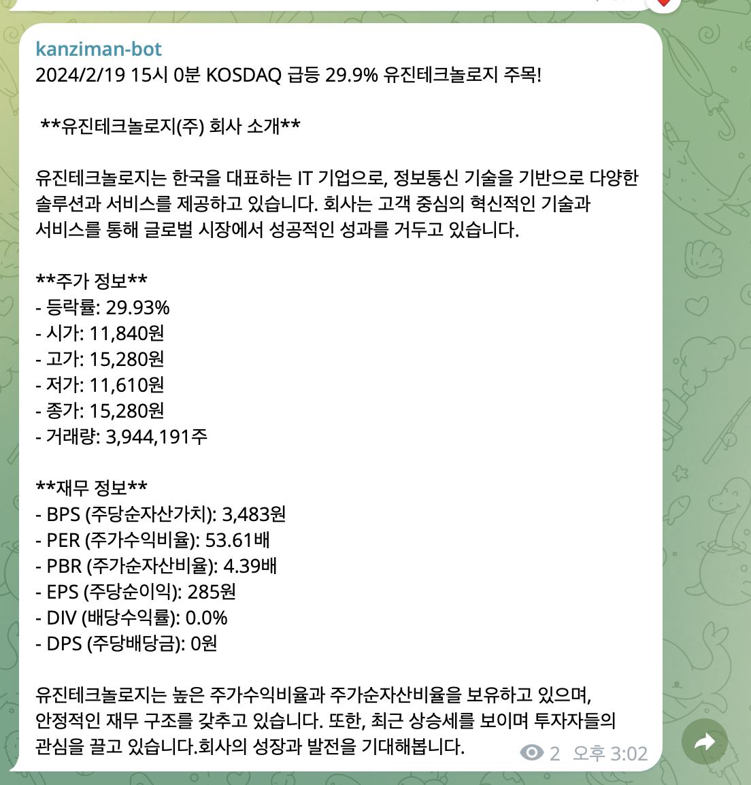

<!-- PROJECT LOGO -->
<br />
<div align="center">

# A-message

Telegram/ChatGPT로 실시간 급등정보 받아보기

</div>

## 📗 Index

-   [📖 About the Project](#about-project)
-   [❓ Contact](#contact)
-   [📝 Install](#install)

<!-- ABOUT THE PROJECT -->

## Overview <a name="about-project"></a>

Airflow 와 Chat GPT를 활용해 매시간 급등 종목의 기업개요 및 재무정보를 Telegram으로 실시간 전송할 수 있습니다.

> IMAGE
> 

## Install <a name="install"></a>

> 실행환경 설정

-   공식문서 [AIRFLOW DOCS](https://airflow.apache.org/docs/apache-airflow/stable/howto/docker-compose/index.html)

## Airflow 설치

-   docker-compose.yaml 다운로드
    curl -LfO 'https://airflow.apache.org/docs/apache-airflow/2.8.1/docker-compose.yaml'

-   Setting the right Airflow user
    1. mkdir -p ./dags ./logs ./plugins ./config
    2. echo -e "AIRFLOW_UID=$(id -u)" > .env
-   init
    docker compose up airflow-init
-   up
    docker compose up

## git clone

-   Dockerfile create(root)

```
FROM apache/airflow:2.8.1
ADD ./airflow-message/requirements.txt .
RUN pip install apache-airflow==${AIRFLOW_VERSION} -r requirements.txt
```

> Parameter

post_cnt_per_market= KOSPI/KOSDAQ 메세지 받을 급등 정보 종목 개수
model= LLM모델

> Airflow Dashboard 에서 변수 설정

chatgpt_api_key (OpenAI or other LLM api key)
chat_id (채팅방 번호: 텔레그램 봇 생성 및 채널 필요)
telegram_token (봇 토큰)

## 🛠 Built With <a name="built-with"></a>

Airflow 2.8.1 / Python / Telegram-bot / pykrx

## Contact <a name="contact"></a>

kanzirunner@gmail.com

## Licencse <a name="license"></a>

This is released under the MIT license. See [LICENSE](https://choosealicense.com/licenses/mit/) for details.
